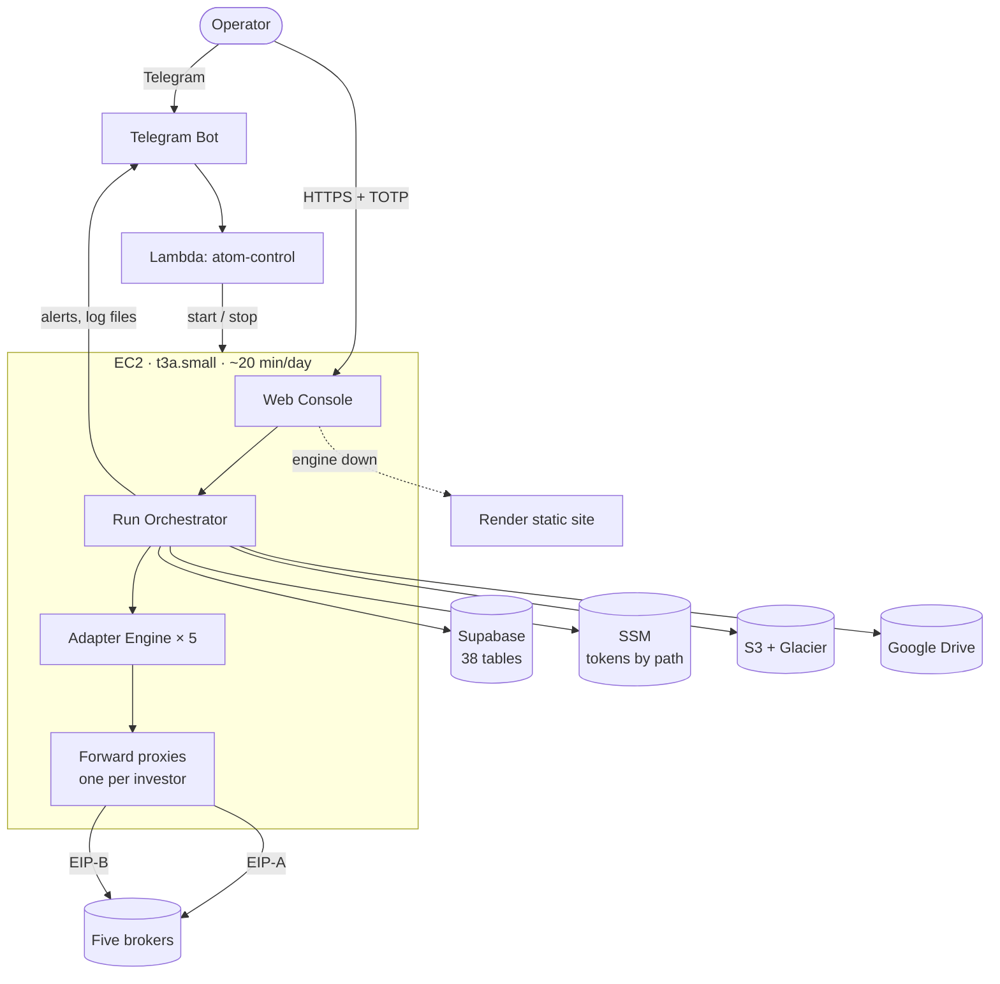
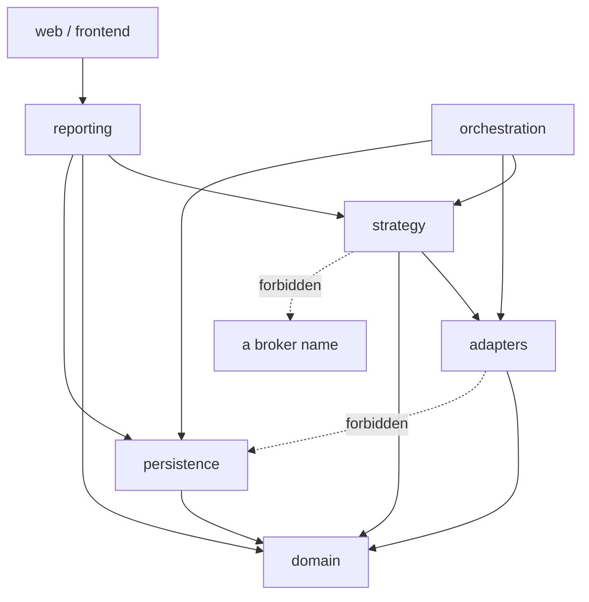
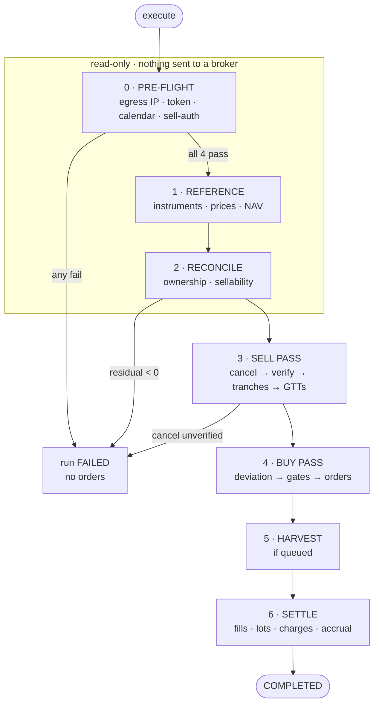
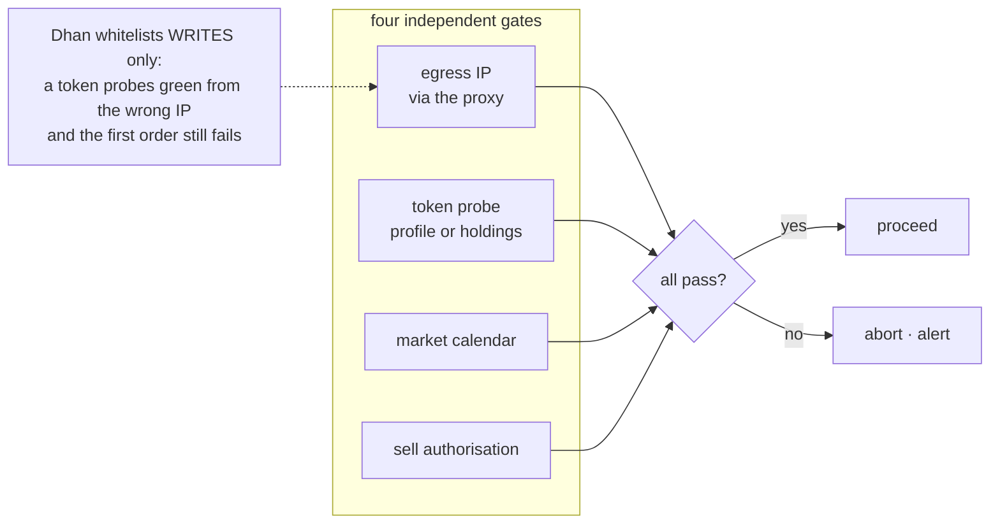
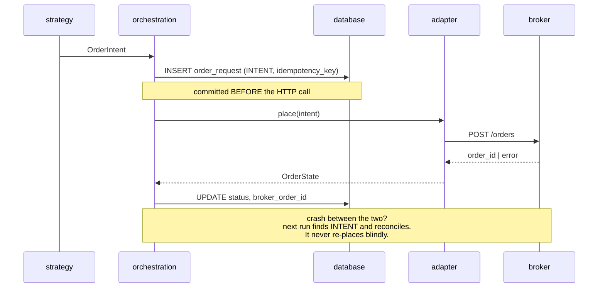
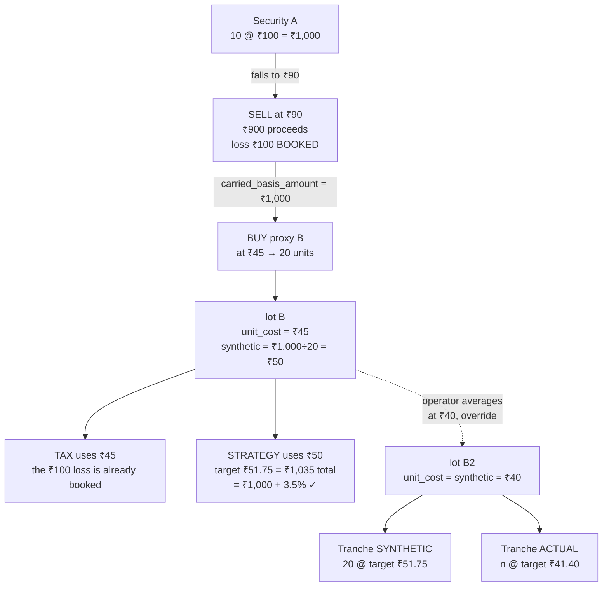
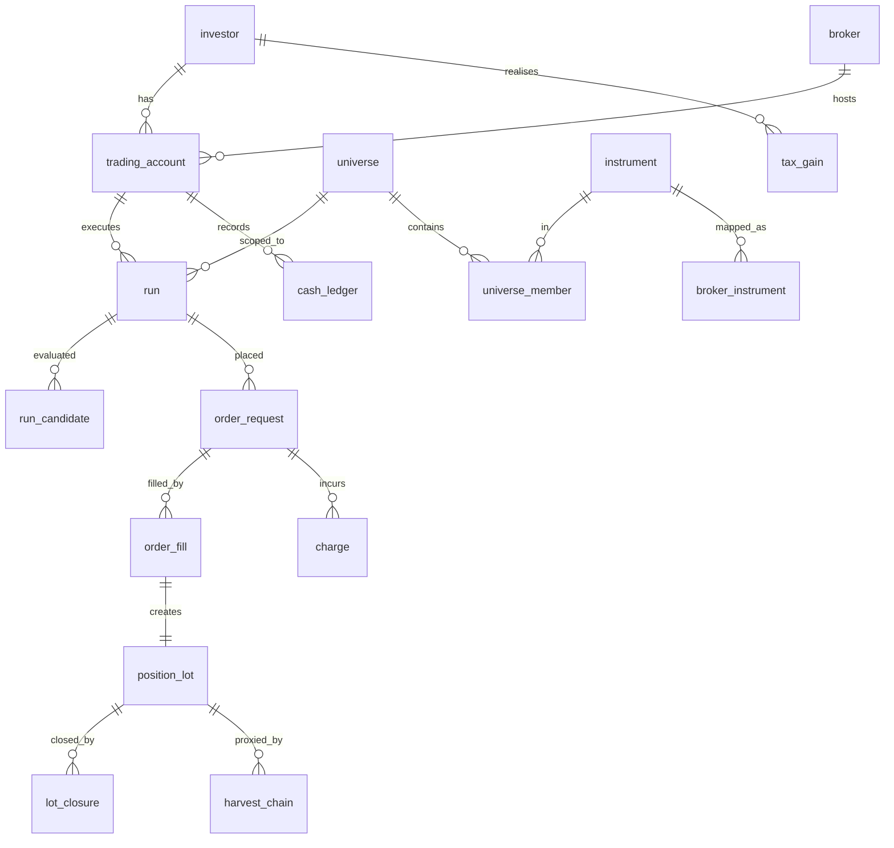
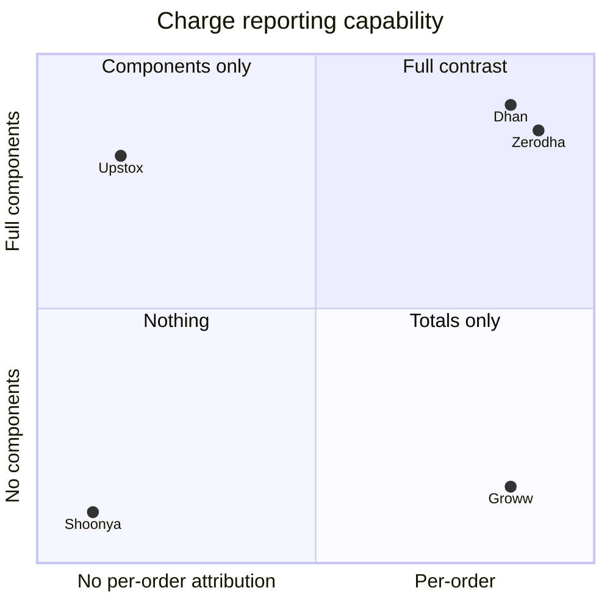

# Diagrams

**Status:** 🟢 Complete
**Date:** 2026-09-26
**Format:** Mermaid — renders natively on GitHub, so these stay readable in the repository

Eight diagrams. Each one answers a question that prose answers badly.

---

## 1. System context

The two things this shows that prose does not: **the operator has two separate paths in** (Telegram
for control, browser for trading), and **every broker call leaves through a proxy** — there is no
direct path from the engine to a broker.

---

## 2. Layers and the import rule

`domain` imports nothing. `adapters` cannot reach `persistence`. `strategy` never names a broker.
Enforced by import-linter in CI, because a documented convention decays and a failing build does not.

---

## 3. The seven phases of a run

Phases 0–2 are read-only. The three paths to `FAILED` are the three conditions under which continuing
would be worse than stopping.

---

## 4. Pre-flight gates — why egress is separate

This diagram exists for one reason: to make it obvious why the token probe cannot subsume the egress
check. On Dhan they test different things.

---

## 5. Adapter engine — two directions, five stages each

```mermaid
flowchart TB
    subgraph IN["INBOUND · broker → database"]
        I1[1 fetch<br/>raw HTTP via proxy] --> I2[2 map<br/>rename + cast only]
        I2 --> I3[3 normalise<br/>⚠ where brokers differ]
        I3 --> I4[4 enrich<br/>resolve instrument_id]
        I4 --> I5[5 persist]
    end
    subgraph OUT["OUTBOUND · database → broker"]
        O1[1 resolve<br/>instrument_id → token] --> O2[2 translate<br/>product · side · validity]
        O2 --> O3[3 serialise<br/>JSON / form / jData]
        O3 --> O4[4 transmit<br/>classify errors]
        O4 --> O5[5 record<br/>⚠ before returning]
    end
```

Stages 1–2 and 4–5 are mechanical and identical across brokers. **Stage 3 is the whole per-broker
document.** Stage O5 records the broker ID *before* returning, because on Zerodha an unrecorded GTT is
permanently unidentifiable.

---

## 6. Order placement — write before send

The note is the point of the diagram. Everything else is obvious; that recovery property is not.

---

## 7. Harvest and the two cost bases

Two things are visible here that the prose takes a page to establish: the carry-over is an **amount**
(₹1,000), not a price — which is why the per-unit figure is ₹50 and not ₹100 — and averaging produces
**two tranches**, never a blend.

---

## 8. Data model — the core

Three structural facts: **one lot per fill** (not per order), **lots belong to a universe** while
**capital belongs to the account**, and **`broker_instrument` is the table that makes five brokers
tractable** — resolution happens once, and the strategy engine only ever sees `instrument_id`.

---

## 9. Charges — what each broker can actually tell us

**Upstox and Groww sit in opposite quadrants** — components without attribution, attribution without
components. Only Dhan and Zerodha support a per-fill, per-component contrast; Shoonya supports none,
so its charges are computed-only and the UI says so.

---

## 10. Source

These are the authoritative versions. If a diagram and a document disagree, the document wins — and
the diagram is a bug.

| Diagram | Document |
|---|---|
| 1, 2 | [`../01-architecture/SYSTEM-OVERVIEW.md`](../01-architecture/SYSTEM-OVERVIEW.md) |
| 3, 4, 6 | [`../01-architecture/RUN-LIFECYCLE.md`](../01-architecture/RUN-LIFECYCLE.md) |
| 2, 5 | [`../03-brokers/ADAPTER-ENGINE.md`](../03-brokers/ADAPTER-ENGINE.md) |
| 7 | [`../04-strategy/HARVEST-COST-BASIS.md`](../04-strategy/HARVEST-COST-BASIS.md) |
| 8 | [`../05-data/DATABASE-SCHEMA.md`](../05-data/DATABASE-SCHEMA.md) |
| 9 | [`../08-reporting/CHARGES-MODEL.md`](../08-reporting/CHARGES-MODEL.md) |
